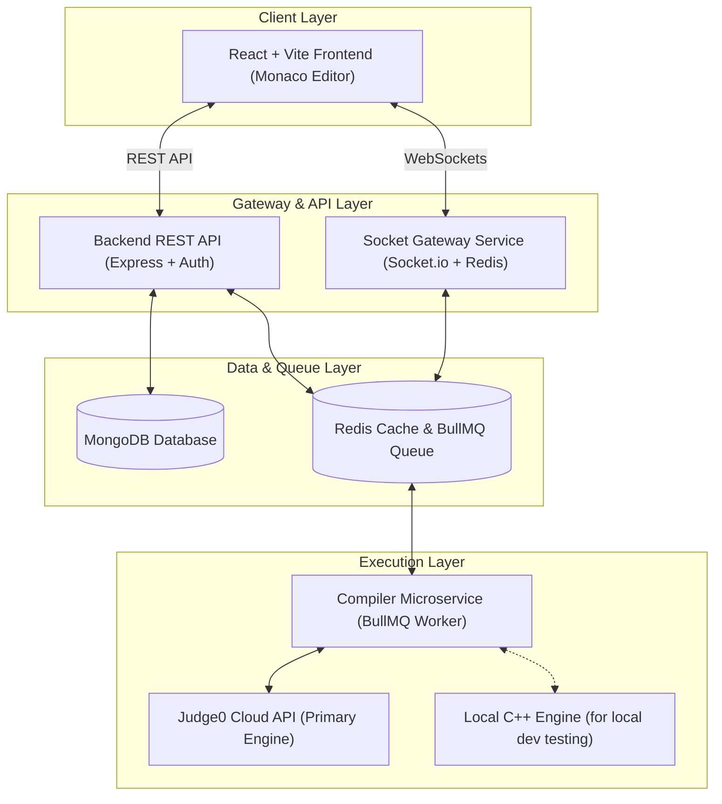

# ⚔️ Coduelo - Real-Time Coding Duels Platform [](https://coduelo.vercel.app)

## 💡 What is Coduelo?

> **Think Faster. Solve Under Pressure. Perform When It Matters Most.**

**Coduelo** is a real-time competitive 1v1 coding platform built for speed, precision, and high-stakes problem solving. Developers race head-to-head live where every second counts:

- ⚡ **Rapid Problem Solving**: Train to analyze constraints, select data structures, and write optimal code at high speed.
- ⏱️ **Head-to-Head Speed Duels**: Race live against real opponents—the first valid submission to pass test cases wins.
- 🧠 **High-Speed Execution Under Pressure**: Build split-second algorithmic decision-making for time-critical coding interviews.

---

## ✨ Key Features & Highlights

- ⚡ **Real-Time 1v1 Coding Battles**: Powered by **Socket.io** with instant live matchmaking, synchronized game state, and instant winner detection.

- 🎯 **Multiple Battle Modes**: Diverse competitive formats including **Random Duel**, **Private Duels**, **Topic Duel**, and **Timed Sprint** tailored for targeted practice.

- 🔐 **Private Duels**: Create custom casual rooms and send private room invitations to practice algorithms or race against friends without losing rating points.

- 🏗️ **Distributed Microservices Architecture**: Decoupled monorepo with 4 independent services (Frontend, Backend API, WebSocket Gateway, Compiler Service) communicating asynchronously via **Redis Pub/Sub & BullMQ**.

- 💻 **Asynchronous Execution Pipeline**: Compiles and evaluates user submissions against hidden test cases using **Judge0 Cloud API** (with local `g++ -O3` engine for dev testing).

- 🏆 **Competitive Rankings & Analytics**: Rating-based rankings, global leaderboards, match history, win rates, and detailed player profiles.

- 🔒 **Enterprise-Grade Security**: JWT authentication with refresh tokens, OTP email verification via **Brevo API**, Zod request validation, and rate-limited REST endpoints.

---

## 🛠️ Tech Stack

<details>
<summary><b>🖥️ Frontend</b></summary>
<br>

| Technology | Purpose |
|---|---|
| React + Vite | High-performance SPA with instant HMR dev server |
| Tailwind CSS | Utility-first responsive styling and UI components |
| Framer Motion | Smooth UI animations and modal transitions |
| `@monaco-editor/react` | Embedded VS Code editor with custom theme & syntax highlighting |
| Socket.io Client | Low-latency WebSocket sync for live 1v1 battle rooms |
| Lucide React | Clean icon suite for interactive UI elements |

</details>

<details>
<summary><b>🔧 Backend API & Gateway</b></summary>
<br>

| Technology | Purpose |
|---|---|
| Node.js (ESM) + Express | RESTful API server with ES Module architecture |
| MongoDB + Mongoose | NoSQL database storing user profiles, battle history & problems |
| Redis + BullMQ | Background job queues and pub/sub real-time event distribution |
| JWT + bcrypt | Secure authentication flow with access & refresh tokens |
| Brevo API | Email OTP verification for account signup & security |

</details>

<details>
<summary><b>⚙️ Compiler Microservice</b></summary>
<br>

| Technology | Purpose |
|---|---|
| Judge0 Cloud API | Primary code execution engine providing unlimited remote execution |
| `g++` (GCC C++20 `-O3`) | Local C++ compilation engine for local development testing |
| `typeHarness.hpp` | Automatic C++ template serialization for all LeetCode data structures |
| BullMQ Worker | Asynchronous execution worker decoupled from API server |

</details>

---

## 🏗️ Architecture



**How a battle submission flows:**

1. Player submits code → Frontend sends it over WebSocket.
2. Socket Gateway enqueues the job into **Redis via BullMQ**.
3. Compiler Worker picks it up, evaluates code via **Judge0 Cloud API**, and runs all test cases.
4. Results are pushed back to Redis → Socket Gateway broadcasts them to both players instantly.

---

## 📁 Project Structure

```
Coduelo/
├── backend/                 # REST API Service (Express.js)
│   └── src/
│       ├── controllers/     # Business logic for auth, users, battles, problems
│       ├── models/          # Mongoose database models & schemas
│       ├── routes/          # API endpoint routes
│       ├── middleware/      # Authentication guards & error handlers
│       └── services/        # Third-party integrations (Brevo Email OTP)
│
├── frontend/                # Single Page Application (React + Vite)
│   └── src/
│       ├── pages/           # Battle room, dashboard, profile, leaderboard
│       ├── components/      # Monaco code editor, UI panels, modals, navbar
│       ├── hooks/           # Real-time socket & battle management hooks
│       └── features/        # Feature-specific state and UI components
│
├── socket-service/          # Real-Time Gateway Service (Socket.io)
│   └── src/
│       ├── handlers/        # Matchmaking queue, battle events, live chat
│       └── config/          # Socket server & Redis pub/sub configuration
│
├── compiler-service/        # Asynchronous Code Execution Worker (BullMQ)
│   └── src/
│       ├── executors/       # Judge0 Cloud API (primary) & local g++ engine
│       ├── drivers/         # C++ test case driver generators
│       ├── harness/         # typeHarness.hpp — universal C++ type serialization
│       └── workers/         # BullMQ queue job consumer
│
├── .env                     # Environment variables & configuration
└── package.json             # Monorepo workspace configuration
```

---

## 🚀 Getting Started

### Prerequisites

| Requirement | Version |
|---|---|
| Node.js | v18 or higher |
| npm | v9 or higher |
| MongoDB | Local or [Atlas](https://cloud.mongodb.com) |
| Redis | Local or [Upstash](https://upstash.com) |
| g++ (GCC) | v10+ (Optional, for local compiler engine) |

### Setup

**1. Clone the repository**
```bash
git clone https://github.com/Yugank-563/Real-Time-Coding-Duels.git
cd Real-Time-Coding-Duels
```

**2. Install dependencies**
```bash
npm install
```

**3. Configure environment**

A `.env.example` file is already included in the repository with all required keys pre-listed. Copy it and fill in your own values:

```bash
cp .env.example .env
```

> Open `.env` and replace the placeholder values with your actual credentials.

**4. Start all services**
```bash
npm run dev
```

| Service | URL |
|---|---|
| Frontend | http://localhost:5173 |
| Backend API | http://localhost:5000 |
| Socket Gateway | http://localhost:5001 |

---

## 🌐 Deployment

Each service is deployed independently:

| Service | Platform | Type |
|---|---|---|
| `frontend/` | Vercel | Static Site |
| `backend/` | Render | Web Service |
| `socket-service/` | Render | Web Service |
| `compiler-service/` | Render | Background Worker |


---

## 📜 License

This project is licensed under the **MIT License** — see the [LICENSE](LICENSE) file for details.
