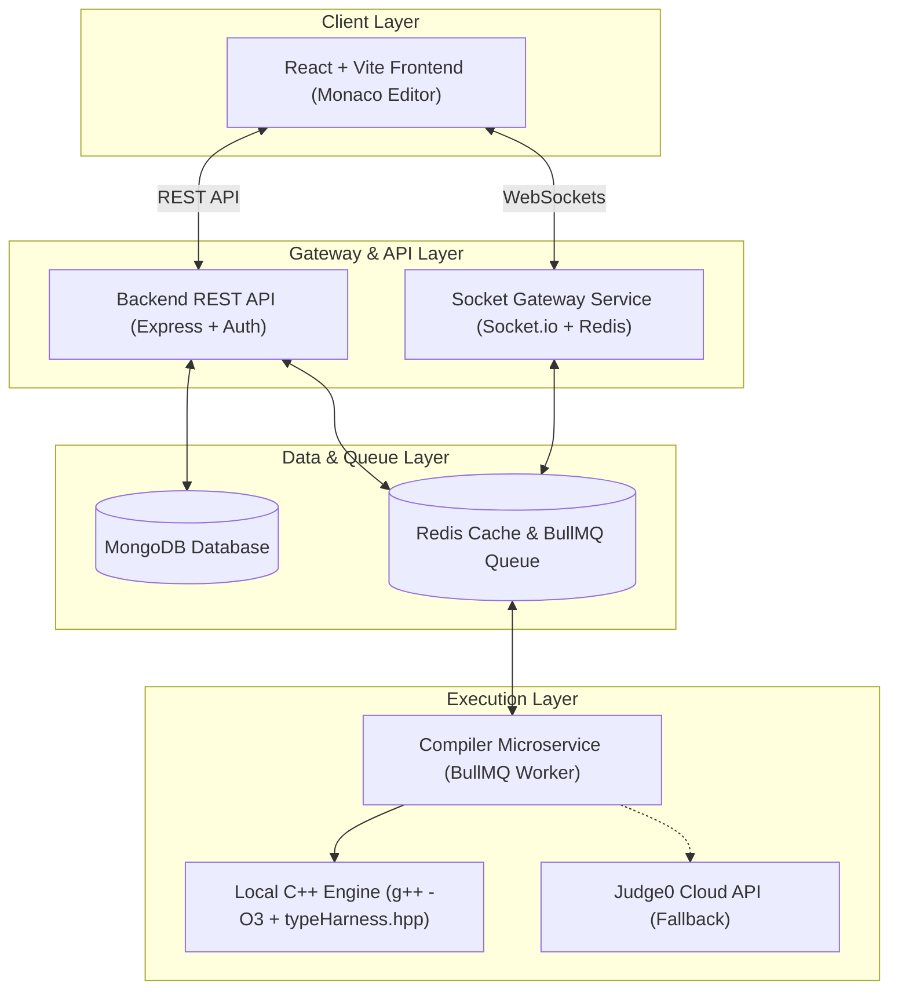

# ⚔️ Coduelo — Real-Time Coding Duels Platform

> A high-performance, real-time multiplayer competitive coding battle platform featuring 1v1 duels, live code execution, automatic data-structure serialization, and instant test case evaluation.

---

## 🌟 Overview

**Coduelo** is an end-to-end real-time competitive programming platform designed for developers to challenge each other in live 1v1 coding duels. Built on a modern microservices architecture, Coduelo combines real-time WebSockets, Monaco code editor, Redis-backed matchmaking, and a zero-latency local C++ compilation engine (`g++ -O3`) supporting advanced data structures (Binary Trees, Linked Lists, 3D DP, and Permutations).

---

## ✨ Key Features

- ⚔️ **Real-Time 1v1 Battles**: Live matchmaking queue with Socket.io rooms, real-time code progress tracking, and live score updates.
- ⚡ **Universal C++ Execution Engine**: Local `g++ -O3` execution with automatic template harness (`typeHarness.hpp`) for Primitives, Vectors, 2D/3D DP Grids, Linked Lists (`ListNode*`), Binary Trees (`TreeNode*`), and In-Place Mutations (`void`).
- 🔄 **Any-Order & Permutation Evaluation**: Smart output normalization supporting solutions returned in any order (e.g. N-Queens, 3Sum, Subsets, Group Anagrams).
- 🤖 **AI Assistant Integration**: Powered by Gemini & Groq APIs for real-time coding hints, debugging help, and problem insights.
- 📝 **Monaco Code Editor**: Rich developer experience with syntax highlighting, autocomplete, auto-indentation, and multi-language support (C++, Python, JavaScript).
- 🏆 **Leaderboards & User Profiles**: Track battle statistics, win rates, match history, and global platform rankings.
- 🔒 **Secure Auth & Email Notifications**: JWT-based authentication with refresh tokens and Brevo email integration.

---

## 🛠️ Tech Stack

### **Frontend**
- **Framework**: React.js 18 + Vite
- **Styling**: Tailwind CSS, Framer Motion
- **Code Editor**: `@monaco-editor/react`
- **Real-time Sync**: `socket.io-client`
- **Icons & UI**: Lucide React

### **Backend Services**
- **Runtime**: Node.js (ES Modules) + Express.js
- **Database**: MongoDB (Mongoose ORM)
- **Caching & Queue**: Redis (Local / Upstash) + BullMQ
- **Authentication**: JWT (Access & Refresh Tokens) + bcrypt
- **Email Service**: Brevo API

### **Compiler Microservice**
- **Compilation Engine**: C++20 (`g++ -O3`), Node.js Worker
- **Type Harness**: Custom C++ Template Harness (`typeHarness.hpp`)
- **Execution Fallback**: RapidAPI Judge0 Cloud API integration

---

## 🏗️ System Architecture



---

## 📁 Repository Structure

```
Coduelo/
├── backend/            # Express REST API, Controllers, Models, Routes & Services
├── frontend/           # React + Vite UI, Monaco Workspace, Battle Rooms & Dashboards
├── socket-service/     # Socket.io Gateway, Matchmaking Queue & Real-time Sync
├── compiler-service/   # Asynchronous BullMQ Execution Service & Local g++ Engine
│   └── src/
│       ├── drivers/    # Universal C++ Driver Generators
│       ├── executors/  # Local & Judge0 Executors
│       └── harness/    # typeHarness.hpp C++ Serialization Templates
├── shared/             # Shared Types, Constants & Utilities
├── docker-compose.yml  # Container Orchestration
└── package.json        # Workspace Monorepo Root Script Configuration
```

---

## 🚀 Getting Started

### Prerequisites

Ensure you have the following installed locally:
- **Node.js**: v18.0.0 or higher
- **npm**: v9.0.0 or higher
- **C++ Compiler**: `g++` (GCC 10+)
- **MongoDB**: Local instance or MongoDB Atlas URI
- **Redis**: Local instance or Upstash Redis URL

---

### Installation

1. **Clone the Repository**:
   ```bash
   git clone https://github.com/your-username/Coduelo.git
   cd Coduelo
   ```

2. **Install Workspace Dependencies**:
   ```bash
   npm install
   ```

3. **Environment Setup**:
   Create a `.env` file in the root directory:
   ```env
   NODE_ENV=development
   BACKEND_PORT=5000
   FRONTEND_URL=http://localhost:5173
   VITE_BACKEND_URL=http://localhost:5000
   SOCKET_PORT=5001
   VITE_SOCKET_URL=http://localhost:5001

   # Database & Redis
   MONGO_URI="your_mongodb_connection_string"
   REDIS_URL="redis://127.0.0.1:6379"

   # Compiler Configuration
   EXECUTOR_TYPE=local

   # Security
   JWT_SECRET="your_jwt_secret"
   JWT_REFRESH_SECRET="your_jwt_refresh_secret"

   # AI Providers
   GEMINI_API_KEY="your_gemini_api_key"
   GROQ_API_KEY="your_groq_api_key"
   ```

---

### Running the Application

Run all services (Frontend, Backend, Socket Service, and Compiler Service) concurrently with a single command:

```bash
npm run dev
```

The services will start at the following ports:
- 💻 **Frontend**: [http://localhost:5173](http://localhost:5173)
- 🔌 **Backend API**: [http://localhost:5000](http://localhost:5000)
- ⚡ **Socket Gateway**: [http://localhost:5001](http://localhost:5001)

---

## 📜 License

This project is licensed under the **MIT License**.
